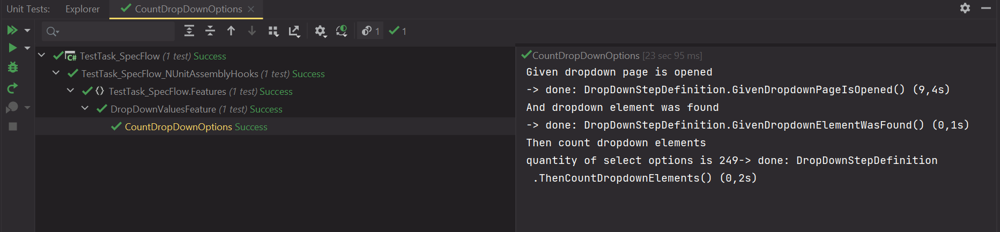

# TestTask_SpecFlow

**TEST TASK**

1. Open your browser and expand it to full screen (BrowserService.cs)
2. Go to following url (DropDownPage.cs 17 line)
3. Find country drop-down element (DropDownListTest.cs 21 line)
4. Make sure that the number of countries in the country drop-down list is correct (249) (DropDownListTest.cs 27 line)
5. Close the browser (BaseTest.cs 20 line)

**MY NOTES:**
1. Test framework was written based on PageObject pattern
2. OOP principles are present
3. Assertions was written with FluentAssertions

**Result of tests**

